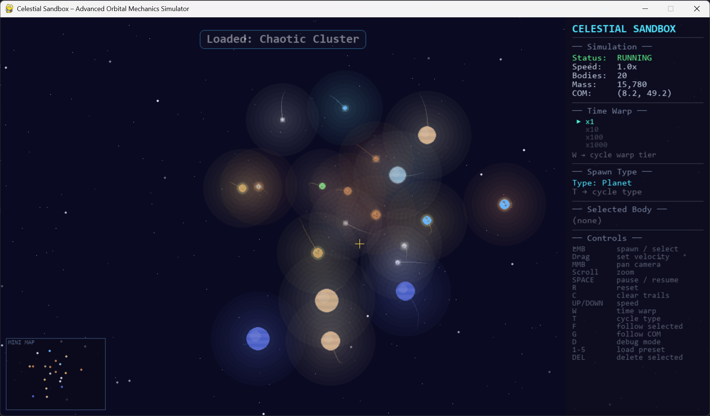
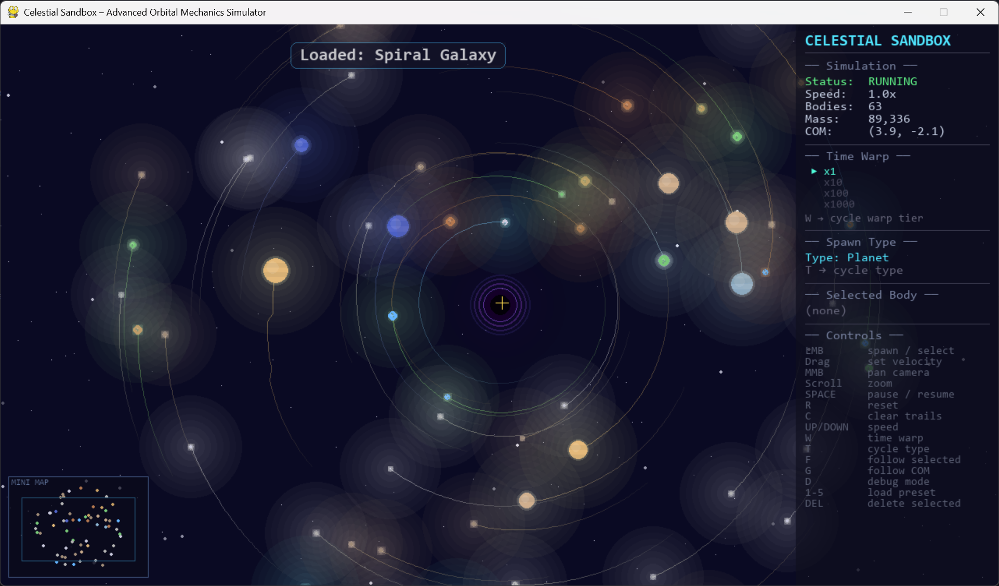
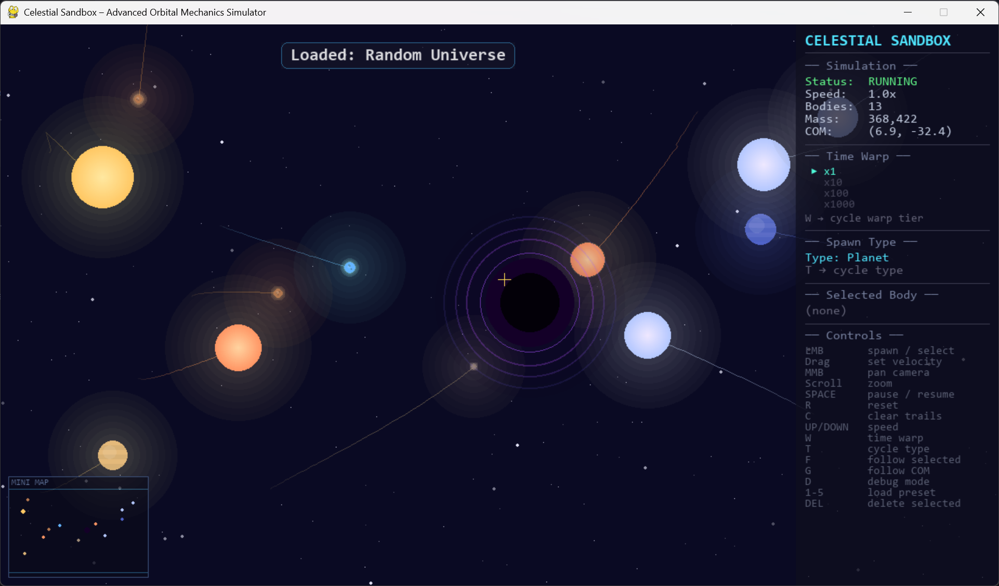

# 🌌 Celestial Sandbox – Advanced Orbital Mechanics Simulator

[](https://python.org)
[](https://pygame.org)
[](LICENSE)

A visually stunning, physically accurate interactive gravity sandbox that simulates orbital mechanics between celestial bodies using Newtonian physics. Explore gravitational systems, create galaxies, and watch celestial bodies dance through space.


<p align="center">
  
</p>

---

## 🔭 Overview

**Celestial Sandbox** is a small-scale physics simulation engine built with Python and Pygame. It provides a scientific sandbox for exploring gravitational systems — from stable solar systems to chaotic cluster interactions and spiral galaxies.

The simulation implements **Newton's Law of Universal Gravitation** with stable velocity-Verlet integration, momentum-conserving collisions, and a modular engine architecture.

---

## ⚛️ Physics Model

### Newton's Law of Universal Gravitation

```
F = G × (m₁ × m₂) / r²
```

Where:

- **F** – gravitational force between two bodies
- **G** – gravitational constant (scaled for simulation)
- **m₁, m₂** – masses of the two bodies
- **r** – distance between their centers

### Integration Method

The simulation uses **Velocity-Verlet integration**, a symplectic integrator that provides excellent energy conservation over long simulation runs:

1. Compute accelerations from gravitational forces
2. Half-step velocity update
3. Full-step position update
4. Recompute accelerations at new positions
5. Second half-step velocity update

### Collision Model

When two bodies overlap, they **merge inelastically**:

- Total momentum is conserved: `p = m₁v₁ + m₂v₂`
- Masses combine: `m_new = m₁ + m₂`
- Radius is recomputed (volume-preserving): `r_new = ∛(r₁³ + r₂³)`

---

## ✨ Features

### Simulation Engine

- 🌍 Newtonian gravity with softened force computation
- 🔄 Velocity-Verlet integration (symplectic, energy-conserving)
- 💥 Inelastic collision merging with momentum conservation
- 📊 Center-of-mass tracking

### Celestial Body Types

| Type            | Mass Range     | Visual                    |
| --------------- | -------------- | ------------------------- |
| 🪨 Planet       | 50–500         | Small, colorful           |
| 🌕 Gas Giant    | 800–3,000      | Large, banded colors      |
| 🌑 Dwarf Planet | 10–50          | Tiny, muted               |
| ⭐ Star         | 5,000–30,000   | Bright, glowing           |
| 🕳️ Black Hole   | 50,000–200,000 | Dark core, accretion ring |

### Interactive Sandbox

- 🖱️ **Click to spawn** bodies at any position
- 🎯 **Drag to set velocity** – visual arrow shows launch direction
- 🔍 **Click to select** – inspect mass, speed, distance, orbital info
- ❌ **Delete selected body** with DEL key

### Visual Design

- 🌌 Procedural multi-layer starfield with parallax
- ✨ Multi-layer glow effects on all bodies
- 🌀 Fading orbit trails
- 🎯 Center-of-mass marker
- 🕳️ Black hole accretion ring rendering
- 📢 Notification flash messages

### Camera System

- 🔎 Scroll-wheel zoom (cursor-centered)
- 🖐️ Middle-mouse drag to pan
- 🎯 Follow a selected body (F key)
- 🌐 Follow system center of mass (G key)

### Preset Systems

| Key | Preset          | Description                                         |
| --- | --------------- | --------------------------------------------------- |
| `1` | Binary Star     | Two stars in mutual orbit with circumbinary planets |
| `2` | Solar System    | Central star with 8 orbiting planets                |
| `3` | Chaotic Cluster | 30 bodies in a dense random cluster                 |
| `4` | Spiral Galaxy   | 80+ bodies in spiral-arm distribution               |
| `5` | Random Universe | Scattered bodies with a random black hole           |

### Developer Tools

- 📈 FPS counter and physics stats
- 🔗 Force vector visualization between body pairs
- 📐 Acceleration vector overlay
- Toggle with `D` key

---

## 🎮 Controls

| Key / Action     | Function                             |
| ---------------- | ------------------------------------ |
| **Left Click**   | Spawn body / Select body             |
| **Left Drag**    | Set velocity vector for new body     |
| **Middle Drag**  | Pan camera                           |
| **Scroll Wheel** | Zoom in / out                        |
| **SPACE**        | Pause / Resume simulation            |
| **R**            | Reset simulation                     |
| **C**            | Clear orbit trails                   |
| **UP / DOWN**    | Increase / Decrease simulation speed |
| **T**            | Cycle spawn body type                |
| **F**            | Follow selected body                 |
| **G**            | Follow center of mass                |
| **D**            | Toggle debug mode                    |
| **DEL**          | Delete selected body                 |
| **1–5**          | Load preset system                   |

---

## 📸 Screenshots

<p align="center">
  
  
</p>
<p align="center">
  
</p>

---

## 🚀 Installation

### Prerequisites

- Python 3.8 or higher
- pip

### Setup

```bash
# Clone the repository
git clone https://github.com/yourusername/celestial-sandbox.git
cd celestial-sandbox

# Install dependencies
pip install -r requirements.txt
```

---

## ▶️ How to Run

```bash
python main.py
```

The simulation will launch with the **Solar System** preset loaded by default. Use the number keys `1–5` to switch between presets, or click and drag to create your own bodies.

---

## 📁 Project Structure

```
celestial-sandbox/
│
├── main.py              # Entry point – game loop and input handling
├── body.py              # CelestialBody class
├── physics_engine.py    # Gravity, collisions, integration
├── renderer.py          # Visual rendering engine
├── camera.py            # Zoom, pan, follow camera system
├── galaxy_generator.py  # Procedural spiral galaxy generator
├── preset_systems.py    # Pre-built simulation scenarios
├── ui_panel.py          # HUD overlay panel
├── debug_tools.py       # Developer debug overlay
├── vector_math.py       # 2D vector math utilities
├── config.py            # Global constants and configuration
├── utils.py             # ID generation, color helpers
├── requirements.txt     # Python dependencies
└── README.md            # This file
```

---

## 🧱 Architecture

The project follows a **modular engine architecture** with clearly separated systems:

```
┌─────────────┐     ┌──────────────┐     ┌────────────┐
│  Input       │────▶│  Simulation  │────▶│  Physics   │
│  System      │     │  Controller  │     │  Engine    │
└─────────────┘     └──────┬───────┘     └────────────┘
                           │
                    ┌──────┴───────┐
                    ▼              ▼
              ┌──────────┐  ┌──────────┐
              │ Renderer │  │ Camera   │
              └──────────┘  └──────────┘
                    │
              ┌─────┴─────┐
              ▼            ▼
        ┌──────────┐ ┌──────────┐
        │ UI Panel │ │  Debug   │
        └──────────┘ └──────────┘
```

---

## 📄 License

This project is open source and available under the [MIT License](LICENSE).

---

## 🙏 Acknowledgments

- Physics model based on Newton's _Principia Mathematica_
- Built with [Pygame](https://pygame.org)
- Inspired by n-body gravitational simulations

---

\*Built with Love My Gravity
